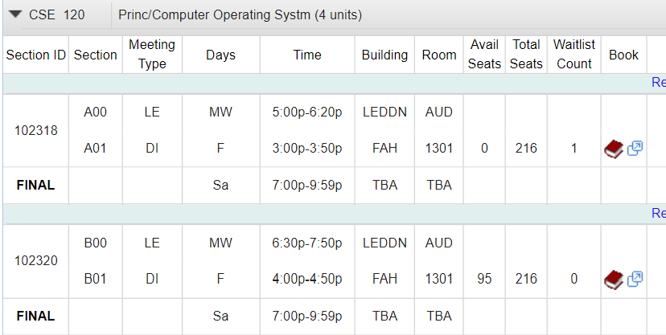

# Spawncamp

Spawncamp is everyone's favorite tool to use during **first pass enrollment** at UCSD. It will automatically enroll you in one of the sections you specify when an opening is found and push a desktop notification for Windows users (remove notification if you want or if you're on Mac/Linux)

Most useful for people with bad enrollment times and have to deal with full classes before even getting
a chance to enroll.

This thing actually got me a spot in CSE 151A lmao

## How it works

Spawncamp will use your Chrome cookies to make HTTP requests to Webreg's API to see if there are any openings in the course you specify. When an opening is found in one of the sections you specify, Spawncamp will enroll you in that section, if more than one section is open, Spawncamp will enroll you in whatever section (that you've specified) it wants.

## Setup

### Prerequisites:

**macOS users: See macOS branch, master branch will only work on Windows.**

Spawncamp assumes you satisfy all prerequisites to enroll in the specified course.

### Installation

1. Clone the repo onto your local machine
2. Run `pip install -r requirements.txt` in the home directory of the repository.
3. Edit the script to monitor the class you're trying to get in, remove notifications if you're on Mac or Linux.

### Usage

1. Edit the script to monitor the class you're trying to get in.
   1. Section ID's can be found in the leftmost column of the course's Webreg listing.  
   
2. Sign into Webreg on Google Chrome, you may need to sign in again later when
   the cookies expire.
3. Run :)
